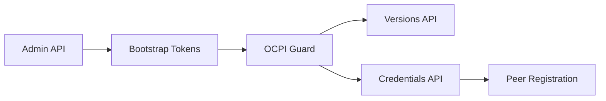

# E-Mobility Platform Documentation

Welcome to the comprehensive documentation for the OCPI-compliant E-Mobility Platform.

## 📋 Table of Contents

### OCPI Implementation
- **[Bootstrap Tokens](./ocpi/bootstrap-tokens/README.md)** - Secure OCPI peer registration system
  - [Admin API Reference](./ocpi/bootstrap-tokens/admin-api.md)
  - [Registration Flow](./ocpi/bootstrap-tokens/registration-flow.md)
  - [Security Guide](./ocpi/bootstrap-tokens/security.md)

## 🚀 Quick Start

### For Administrators
1. **Generate Bootstrap Token**: Use the admin API to create tokens for new OCPI peers
2. **Share Securely**: Distribute tokens via encrypted channels
3. **Monitor Usage**: Track token usage and clean up expired tokens

### For OCPI Partners
1. **Receive Bootstrap Token**: Get token from CPO/EMSP via secure channel
2. **Register**: Use token to complete OCPI handshake
3. **Integrate**: Begin operational OCPI communication

### For Developers
1. **Review Architecture**: Understand the bootstrap token system design
2. **Security Guidelines**: Follow security best practices
3. **Testing**: Use the troubleshooting guide for development

## 🔧 System Components

### Bootstrap Token System
The bootstrap token system implements the OCPI 2.2.1 CREDENTIALS_TOKEN_A functionality:



**Key Features:**
- ✅ Secure token generation with 256-bit entropy
- ✅ Single-use enforcement
- ✅ Automatic expiration
- ✅ Complete audit trail
- ✅ OCPI 2.2.1 compliant

## 📚 Documentation Structure

```
documentation/
├── README.md                           # This file
└── ocpi/
    └── bootstrap-tokens/
        ├── README.md                   # Overview and quick start
        ├── admin-api.md               # Complete API reference
        ├── registration-flow.md       # Step-by-step OCPI handshake
        └── security.md               # Security guide and troubleshooting
```

## 🛠️ Development Setup

### Prerequisites
- Node.js 18+
- PostgreSQL 14+
- pnpm package manager

### Environment Configuration
```bash
# Copy environment template
cp .env.example .env

# Configure OCPI settings
OCPI_BASE_URL=https://your-domain.com
OCPI_PARTY_ID=YOUR_PARTY_ID
OCPI_COUNTRY_CODE=NL
OCPI_BUSINESS_NAME=Your Business Name
OCPI_BUSINESS_WEBSITE=https://your-business.com

# Optional: Enhanced token security
TOKEN_HMAC_SECRET=your-secure-hmac-secret
```

### Database Setup
```bash
# Start PostgreSQL
pnpm docker:dev:up

# Run migrations
pnpx prisma migrate dev

# Seed data (optional)
pnpx prisma db seed
```

### Development Commands
```bash
# Start development server
pnpm start:dev

# Run tests
pnpm test

# Build for production
pnpm build

# Lint and format
pnpm lint
pnpm format
```

## 🔒 Security Considerations

### Production Deployment
- **HTTPS Only**: Never use HTTP in production
- **Admin Authentication**: Implement proper admin API security
- **Token Security**: Use secure channels for token distribution
- **Monitoring**: Set up alerts for suspicious activity

### Best Practices
- Set appropriate token expiration periods
- Regular cleanup of expired tokens
- Comprehensive audit logging
- Regular security updates

## 🤝 OCPI Compliance

This platform implements OCPI 2.2.1 specification:
- **Versions Module**: Endpoint discovery
- **Credentials Module**: Secure peer registration
- **Security**: Token-based authentication
- **Error Handling**: Standard OCPI status codes

## 📞 Support

### Technical Issues
- Check [Security Guide](./ocpi/bootstrap-tokens/security.md) for troubleshooting
- Review application logs for error details
- Verify HTTPS and certificate configuration

### Integration Support
- Follow [Registration Flow](./ocpi/bootstrap-tokens/registration-flow.md) documentation
- Use [Admin API](./ocpi/bootstrap-tokens/admin-api.md) for token management
- Contact technical team for integration assistance

## 📈 Monitoring

### Key Metrics
- Bootstrap token generation rate
- Token usage success rate
- Authentication failure rate
- Peer registration completions

### Health Checks
- Database connectivity
- OCPI endpoint availability
- Token validation performance
- External API dependencies

## 🔄 Updates and Maintenance

### Regular Tasks
- Monitor token usage patterns
- Clean up expired tokens
- Review security logs
- Update dependencies

### Backup and Recovery
- Database backups
- Configuration backups
- Disaster recovery procedures
- Data retention policies

---

*This documentation is maintained alongside the codebase and updated with each release.*