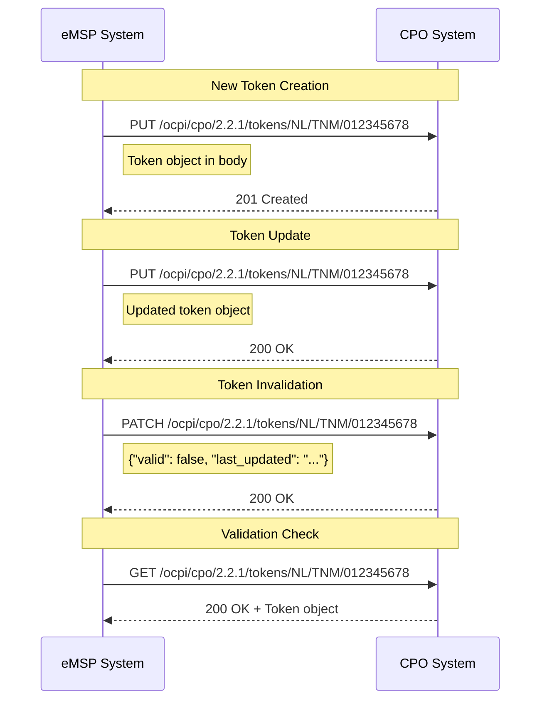
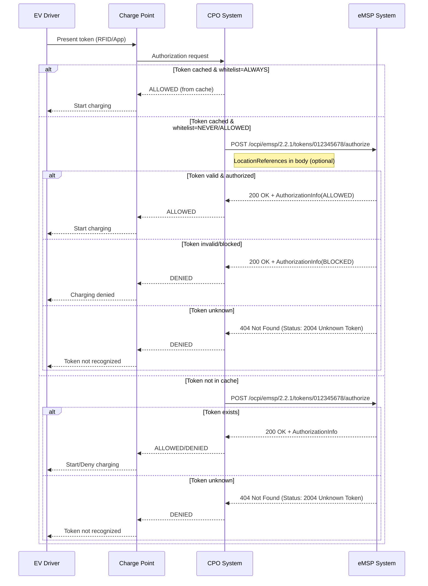
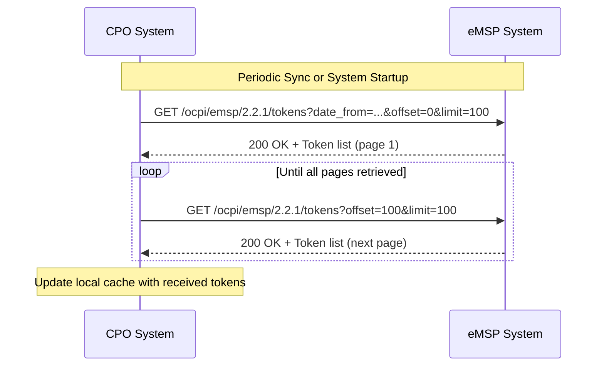

# OCPI 2.2.1 Token Module Flow Documentation

## Overview

Based on OCPI 2.2.1 specification section 12, the Token module enables CPOs to maintain knowledge of eMSP tokens for charging authorization. **Data owner: eMSP**

**Key Purpose**: eMSPs push Token information to CPOs so CPOs can build a cache of known tokens. When authorization is requested from a Charge Point, the CPO can check against this cache and know which eMSP to send CDRs to later.

## Token Flow Models

### 12.1.1 Push Model (Primary Flow)

**Token Creation/Updates (eMSP → CPO):**
1. eMSP creates new Token → `PUT /ocpi/cpo/2.2.1/tokens/{country_code}/{party_id}/{token_uid}`
2. eMSP updates Token → `PUT` or `PATCH /ocpi/cpo/2.2.1/tokens/{country_code}/{party_id}/{token_uid}`
3. eMSP invalidates Token → `PATCH` with `valid: false`
4. eMSP validates CPO cache → `GET /ocpi/cpo/2.2.1/tokens/{country_code}/{party_id}/{token_uid}`

### 12.1.2 Pull Model (Sync Flow)

**Token Synchronization (CPO → eMSP):**
- CPO requests full token list → `GET /ocpi/emsp/2.2.1/tokens`
- Used for system startup or periodic sync (NOT real-time operations)
- Supports pagination and date filtering

### 12.1.3 Real-time Authorization Flow

**Authorization Request (CPO → eMSP):**
1. EV presents token at Charge Point
2. CPO checks local cache
3. If `whitelist != ALWAYS` → `POST /ocpi/emsp/2.2.1/tokens/{token_uid}/authorize`
4. eMSP validates and responds with authorization decision

## Detailed Flow Sequences

### Token Registration Flow (Push Model)


### Real-time Authorization Flow


### Token Synchronization Flow (Pull Model)


## OCPI 2.2.1 API Endpoints Specification

### 12.2.1 CPO Receiver Interface
**Implementation Role**: CPO
**URL Pattern**: `{token_endpoint_url}/{country_code}/{party_id}/{token_uid}[?type={type}]`

#### GET Method
**Purpose**: eMSP retrieves token from CPO cache for validation
```http
GET /ocpi/cpo/2.2.1/tokens/NL/TNM/012345678?type=RFID
Authorization: Token {cpo-token}

Response: 200 OK
{
  "status_code": 1000,
  "data": {
    "country_code": "NL",
    "party_id": "TNM",
    "uid": "012345678",
    "type": "RFID",
    "contract_id": "NL8ACC12E46L89",
    "visual_number": "DF000-2001-8999-1",
    "issuer": "TheNewMotion",
    "group_id": "DF000-2001-8999",
    "valid": true,
    "whitelist": "ALWAYS",
    "last_updated": "2015-06-29T22:39:09Z"
  }
}
```

#### PUT Method
**Purpose**: eMSP pushes new/updated token to CPO
```http
PUT /ocpi/cpo/2.2.1/tokens/NL/TNM/012345678
Authorization: Token {cpo-token}
Content-Type: application/json

{
  "country_code": "NL",
  "party_id": "TNM",
  "uid": "012345678",
  "type": "RFID",
  "contract_id": "NL8ACC12E46L89",
  "visual_number": "DF000-2001-8999-1",
  "issuer": "TheNewMotion",
  "group_id": "DF000-2001-8999",
  "valid": true,
  "whitelist": "ALWAYS",
  "last_updated": "2015-06-29T22:39:09Z"
}

Response: 201 Created (new) or 200 OK (update)
```

#### PATCH Method
**Purpose**: eMSP sends partial token updates (e.g., invalidation)
```http
PATCH /ocpi/cpo/2.2.1/tokens/NL/TNM/012345678
Authorization: Token {cpo-token}
Content-Type: application/json

{
  "valid": false,
  "last_updated": "2019-06-19T02:11:11Z"
}

Response: 200 OK
```

### 12.2.2 eMSP Sender Interface
**Implementation Role**: eMSP

#### GET Method
**Purpose**: CPO requests token list for synchronization
**URL Pattern**: `{tokens_endpoint_url}?[date_from={date_from}]&[date_to={date_to}]&[offset={offset}]&[limit={limit}]`

```http
GET /ocpi/emsp/2.2.1/tokens?date_from=2019-01-28T12:00:00&offset=50&limit=100
Authorization: Token {emsp-token}

Response: 200 OK
{
  "status_code": 1000,
  "data": [
    {
      "country_code": "NL",
      "party_id": "TNM",
      "uid": "012345678",
      "type": "RFID",
      "contract_id": "NL8ACC12E46L89",
      "issuer": "TheNewMotion",
      "valid": true,
      "whitelist": "ALLOWED",
      "last_updated": "2015-06-29T22:39:09Z"
    }
  ]
}
```

#### POST Method - Real-time Authorization
**Purpose**: CPO requests real-time token authorization
**URL Pattern**: `{tokens_endpoint_url}{token_uid}/authorize[?type={type}]`

```http
POST /ocpi/emsp/2.2.1/tokens/012345678/authorize
Authorization: Token {emsp-token}
Content-Type: application/json

{
  "location_id": "LOC001",
  "evse_uids": ["EVSE001", "EVSE002"]
}

Response: 200 OK
{
  "status_code": 1000,
  "data": {
    "allowed": "ALLOWED",
    "token": {
      "country_code": "NL",
      "party_id": "TNM",
      "uid": "012345678",
      "type": "RFID",
      "contract_id": "NL8ACC12E46L89",
      "issuer": "TheNewMotion",
      "valid": true,
      "whitelist": "ALLOWED",
      "last_updated": "2015-06-29T22:39:09Z"
    },
    "location": {
      "location_id": "LOC001",
      "evse_uids": ["EVSE001"]
    },
    "authorization_reference": "AUTH123456",
    "info": {
      "language": "en",
      "text": "Welcome! You have sufficient credit."
    }
  }
}

// Unknown token response:
Response: 404 Not Found
{
  "status_code": 2004,
  "status_message": "Unknown Token",
  "timestamp": "2019-06-19T02:11:11Z"
}
```

## OCPI Data Types and Business Rules

### 12.4.1 AllowedType Enum (Authorization Responses)
- **ALLOWED**: Token allowed to charge (at this location)
- **BLOCKED**: Token is blocked
- **EXPIRED**: Token has expired
- **NO_CREDIT**: Insufficient credits to charge
- **NOT_ALLOWED**: Valid token but not allowed at given location

### 12.4.4 TokenType Enum
- **AD_HOC_USER**: One-time server-generated ID (App user)
- **APP_USER**: Persistent server-generated ID for App user
- **OTHER**: Other type of token
- **RFID**: RFID Token

### 12.4.5 WhitelistType Enum
- **ALWAYS**: Token always whitelisted, no real-time auth needed
- **ALLOWED**: Whitelisting OR real-time auth allowed (CPO choice)
- **ALLOWED_OFFLINE**: Real-time auth preferred, offline whitelisting when eMSP unreachable
- **NEVER**: Only real-time authorization allowed, no whitelisting

### Token Business Logic

#### Authorization Decision Flow
```typescript
// CPO authorization logic
function authorizeToken(token: Token, location?: LocationReference): AuthorizationDecision {
  // 1. Check token validity
  if (!token.valid) {
    if (token.whitelist === 'NEVER' || token.whitelist === 'ALLOWED') {
      return realTimeAuthorize(token, location) // Token state might have changed
    }
    return 'BLOCKED'
  }

  // 2. Check whitelist type
  switch (token.whitelist) {
    case 'ALWAYS':
      return 'ALLOWED' // No real-time check needed

    case 'NEVER':
      return realTimeAuthorize(token, location) // Always require real-time

    case 'ALLOWED':
      // CPO can choose: use cache or real-time
      return useCache ? 'ALLOWED' : realTimeAuthorize(token, location)

    case 'ALLOWED_OFFLINE':
      try {
        return realTimeAuthorize(token, location)
      } catch (eMSPUnreachable) {
        return 'ALLOWED' // Fallback to offline authorization
      }
  }
}
```

#### Token Lifecycle Rules
1. **Token Creation**: eMSP creates → PUT to CPO
2. **Token Updates**: Any changes → PUT/PATCH to CPO
3. **Token Invalidation**: Set `valid: false` → PATCH to CPO (cannot delete)
4. **Real-time Auth**: Required when `whitelist ≠ ALWAYS`
5. **Cache Validation**: eMSP can GET from CPO to verify cache state

### Performance & UX Considerations

**Real-time Authorization Notes (from OCPI spec):**
- RFID authorization delays impact user experience - minimize processing time
- Real-time auth may occur at unpublished locations (private chargers) → typically ALLOWED
- eMSP SHALL NOT validate location constraints (opening hours, EVSE status) as info may be stale
- Recommended: APP_USER/AD_HOC_USER tokens should use `whitelist: NEVER` (no caching benefit)

## OCPI Error Handling

### Error Codes for Token Module
- **2001**: Invalid or missing parameters (malformed token data)
- **2002**: Not enough information (insufficient LocationReferences for authorization)
- **2003**: Unknown Token (token not found in CPO system)
- **2004**: Unknown Token (during authorization request - token unknown to eMSP)
- **3001**: Unable to use client API (eMSP unreachable during real-time auth)

### Error Response Examples
```http
// Token not found during authorization
Response: 404 Not Found
{
  "status_code": 2004,
  "status_message": "Unknown Token",
  "timestamp": "2023-01-15T10:30:00.000Z"
}

// Invalid token data in PUT request
Response: 400 Bad Request
{
  "status_code": 2001,
  "status_message": "Invalid or missing parameters: country_code is required",
  "timestamp": "2023-01-15T10:30:00.000Z"
}

// eMSP unreachable during real-time authorization
Response: 500 Internal Server Error
{
  "status_code": 3001,
  "status_message": "Unable to use the client's API",
  "timestamp": "2023-01-15T10:30:00.000Z"
}
```

## Implementation Strategy (TDD Approach)

### Phase 1: Domain Model & Tests
1. **Token Aggregate Root** with Zod validation
2. **Value Objects**: TokenId, AuthorizationInfo, LocationReferences
3. **Enums**: TokenType, WhitelistType, AllowedType
4. **Unit tests** for all domain logic and business rules

### Phase 2: Repository & Service Tests
1. **TokenRepository** interface and Prisma implementation
2. **TokenService** for business logic (authorize, sync, cache)
3. **Integration tests** with in-memory database

### Phase 3: Controllers & API Tests
1. **CPO Token Controller** (GET, PUT, PATCH endpoints)
2. **eMSP Token Controller** (GET, POST authorize endpoints)
3. **API integration tests** with test clients

### Phase 4: End-to-End Flow Tests
1. **Complete authorization flow** tests
2. **Token synchronization** tests
3. **Error scenario** tests
4. **Performance** tests for real-time authorization

---

*This flow documentation is based on OCPI 2.2.1 specification section 12 and serves as the implementation blueprint for the Token module.*